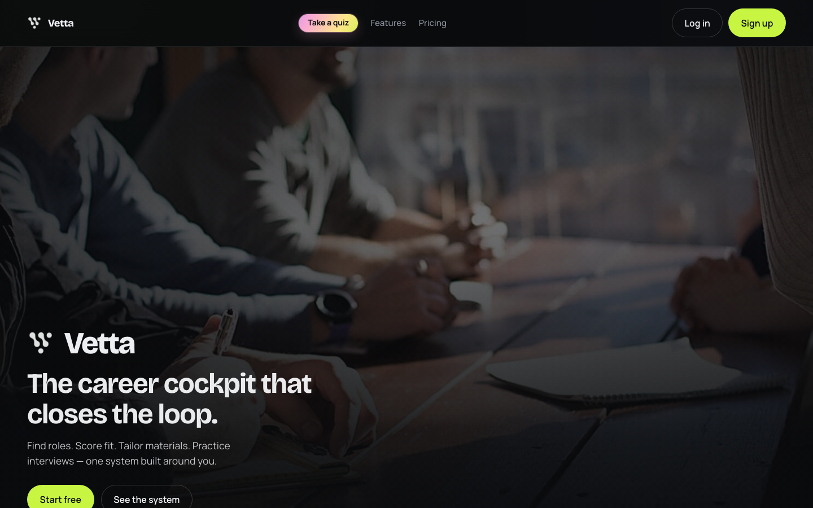
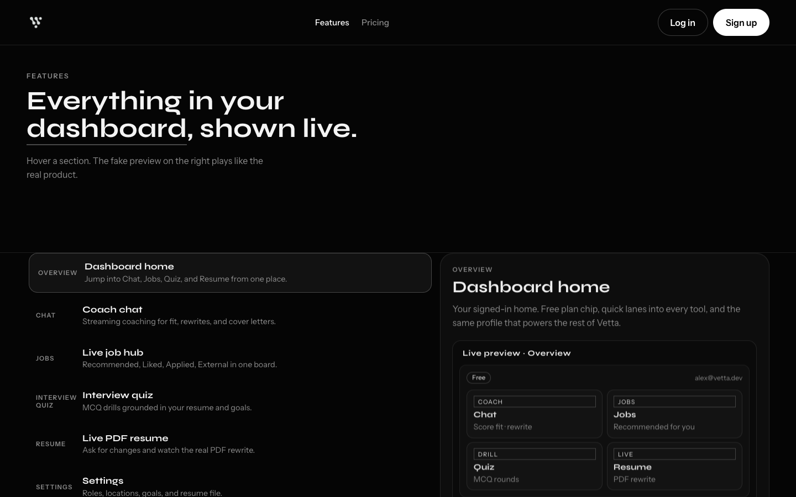
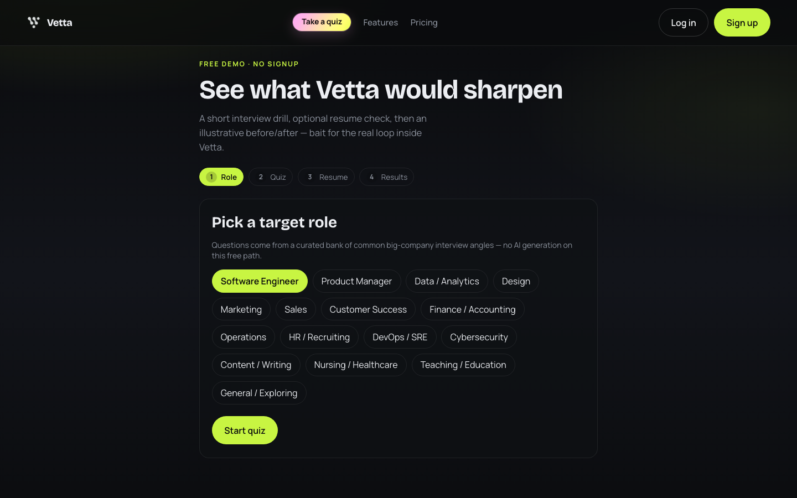
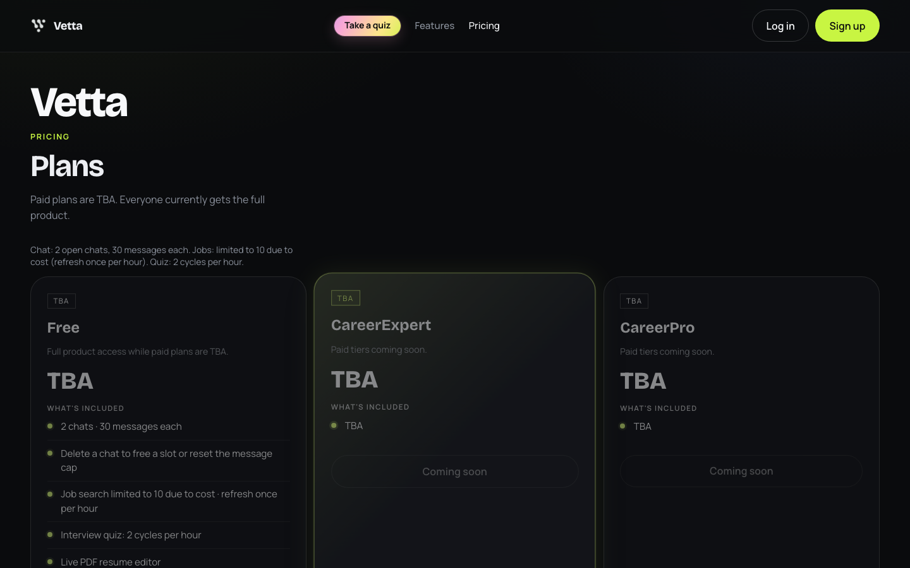

# Vetta

Career coach app I built for job search: chat with an AI coach, browse live roles, practice interview questions, and edit your resume as a real PDF.

<p align="center">
  
</p>

## What’s inside

| Area | What it does |
|------|----------------|
| **Chat** | Streaming coach for job market questions, fit scores, rewrites, cover letters |
| **Jobs** | Recommended / Liked / Applied / External hub (Adzuna first, free tier) |
| **Interview Quiz** | MCQs grounded in your resume and goals |
| **Resume** | Tell it what to change; preview is the actual multi-page PDF; download when ready |
| **Settings / Plans** | Preferences, resume upload; paid plans TBA |

<p align="center">
  
</p>

<p align="center">
  
</p>

## Stack

- FastAPI + LangChain / LangGraph (`claude-haiku-4-5` via `AI_MODEL`)
- React (Vite) UI, served from the same Render service in production
- Supabase auth + Postgres
- Jobs: Adzuna → JSearch → Tavily (Apify off by default)
- Stripe optional (paid plans TBA)
- LangSmith tracing optional

## Run locally

```bash
cp .env.example .env
# fill Anthropic, Supabase, Tavily, Adzuna, LangSmith, Stripe

uv sync
uv run uvicorn app.main:app --reload --port 8000

cd frontend && npm install && npm run dev
```

Open http://localhost:5173

Supabase: run `supabase/schema.sql` (and `job_saves.sql` if you need likes/applied).

**Auth:** Authentication → Providers → Email → turn **Confirm email** OFF so signup returns a session immediately. Allowlist `http://localhost:5173/reset-password` (and prod) under URL configuration for password reset.

### Billing (TBA)

Paid plans are **TBA** — Pricing/Plans are greyed out and Stripe checkout/portal/sync return 503.
Everyone currently gets full product access with cost caps (see `.env.example`):

- Chat: 2 open chats · 30 messages each (delete a chat to continue)
- Jobs: limited to 10 due to cost · refresh once per hour
- Quiz: 2 cycles per hour

Stripe env vars are optional and unused until billing ships.

## Deploy on Render (free)

This repo is set up for **one free Web Service** via `render.yaml`.

1. Push to GitHub (see below)
2. [Render](https://dashboard.render.com) → **New** → **Blueprint** → select this repo
3. Confirm plan is **Free**
4. Paste secret env vars (same names as `.env.example`). Required: `ANTHROPIC_API_KEY`, `SUPABASE_URL`, `SUPABASE_ANON_KEY`, plus Adzuna / Tavily / LangSmith as you use them. Cost-cap knobs (`MAX_CHATS`, `JOBS_MAX_ITEMS`, etc.) are already set in `render.yaml`.
5. Deploy. Health check: `/api/health`
6. In Supabase Auth → URL config, add `https://YOUR-APP.onrender.com`

Free Render sleeps after idle; first hit can take ~30s.

<p align="center">
  
</p>

## Env

See `.env.example`. Never commit `.env`.

## Layout

```
app/           API + agent + resume PDF
frontend/      React app
supabase/      SQL
render.yaml    Free-tier Blueprint
docs/screenshots/
```

Built by [WafflesDevs](https://github.com/WafflesDevs).
